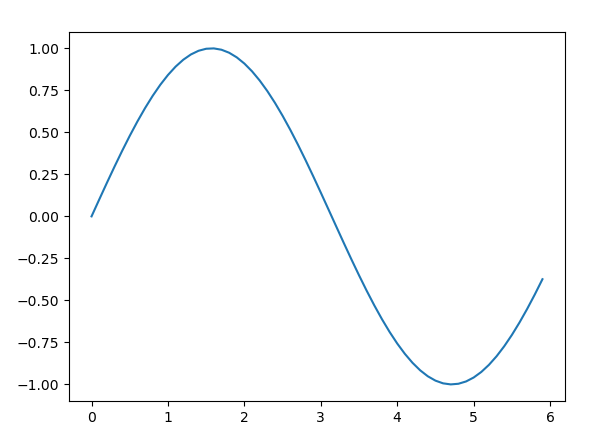
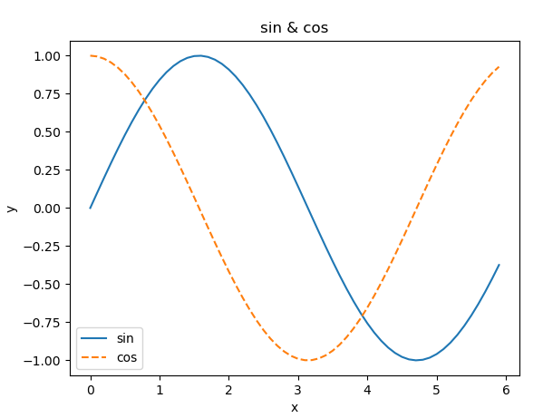
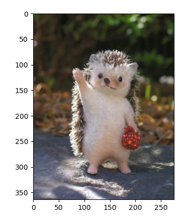

/01. machine learning study- python/

본 내용은 <밑바닥부터 시작하는 딥러닝>을 참고하여 작성하였습니다.


# Python

## 개발환경 구축

굳이 아나콘다를 설치하지 않아도 이왕 하는 거 제대로 하고 싶어서 아나콘다를 설치했다.

### 아나콘다(Anaconda)

: Python 기반의 데이터 분석에 필요한 오픈소스를 모아놓은 개발 플랫폼

  가상환경 관리자, 패키지 관리자 제공


1. 아나콘다 설치

   [링크] https://www.anaconda.com/products/individual

   ❗ 기존에 파이썬이 설치되어 있다면 반드시 기존 파이썬을 지운 후 설치. (충돌 에러 방지)

   ❗ _Add Anaconda3 to my PATH environment variable_ 꼭 체크

      : cmd창에서 사용할 때 환경변수를 설정하는 번거로움 막기 위해

   
   
   
   
2. 텐서플로우 설치

   2-1. 가상환경 생성

   - 프로젝트에 필요한 파이썬 버전으로 가상환경 만듬. 

   - 가상환경 이름은 무엇이든 상관없다. (여기서는 tensorflow)

   ```cmd
   >conda create --name tensorflow python=3.7
   
   >conda create --n tensorflow python=3.7 #도 가능
   ```

   2-2. 가상환경 활성화(Active)

   ```cmd
   # 설치 된 가상환경 리스트 확인
   >conda info --envs
   
   # 가상환경 활성화
   >activate tensorflow
   
   # 가상환경 비활성화 (텐서플로우 설치해야하기 때문에 이건 하지 않는다.)
   >deactivate tensorflow
   ```

   2-3. 텐서플로우 설치

   ```cmd
   
   ```
>conda install tensorflow=2.1
   
   ```
   
   ```

   

   ❗❗ `ModuleNotFoundError: No module named 'matplotlib'` 이런 에러가 났을때는?

     ```cmd
   >conda install matplotlib
     
     ```
     
     ```

   

5. 파이참 환경 설정

   3-1. 파이참 새 프로젝트를 생성

   3-2. File -> Setting ->project: machine learning -> Python interpreter -> 오른쪽 위 톱니바퀴

   3-3. Add -> Conda Environment -> Existing environment -> interpreter 오른쪽 ... ->경로지정

   경로: C:\Users\아이디\Anaconda3\envs\가상환경이름(tensorflow)\pythonw.exe

   

   

6. 오른쪽 하단에 설치가 끝나면,  설치 잘 되었는지 확인

   ```python
   import tensorflow as tf
   print(tf.__version__)  # 2.1.0
   ```

   

[참고] https://it-recording.tistory.com/12

[참고] https://niceman.tistory.com/85?category=940952

❓ https://theorydb.github.io/dev/2020/02/14/dev-dl-setting-local-python/ 다음 링크의 개발환경구축하기에서 Nvidia가 도대체 뭐길래 디스플레이 어댑터가 저거 아니면 돌아가라는거지? 

Q. AMD나 Intel에서도 OpenCL 프레임워크로 딥러닝을 활용할 수는 있지만 쉽지 않다고 한다. 딥러닝프레임워크(https://www.slideshare.net/JunyiSong1/ss-75552936) 참고하라고 하는데 아무튼 읽어봐야겠음.

## Numpy

1. 넘파이 가져오기

   ```python
   import numpy as np
   ```

2. 넘파이 배열 생성하기

   np.array(): 리스트를 인수로 받아 넘파이 라이브러리가 제공하는 특수한 형태의 배열(numpy.ndarray) 반환

   ```python
   x = np.array([1.0, 2.0, 3.0])
   print(x)  # [1. 2. 3.]
   type(x)  # <class 'numpy.ndarray'>
   ```

3. 넘파이 산술연산

   ```python
   x = np.array([1.0, 2.0, 3.0])
   y = np.array([2.0, 4.0, 6.0])
   x + y  # array([3., 6., 9.])  
   x - y  # array([-1., -2., -3.])
   x * y  # array([2., 8., 18.])
   x / y  # array([0.5, 0.5, 0.5])
   ```

   💡 element-wise(원소별) 연산: 같은 형태(shape)의 배열(벡터, 행렬)간의 연산은 같은 index의 원소끼리 연산을 한다. 배열간의 연산시 배열의 형태가 같아야한다. (원소수가 다르면 오류가 발생) 만약 배열의 형태가 다른 경우, __Broadcast__ 조건을 만족하면 연산이 가능하다. (5. 참고)

   

4. 넘파이의 N차원 배열

   넘파이는 1차원 배열 뿐 아니라 다차원 배열도 작성할 수 있다.

   ```python
   # 2차원 배열(행렬)
   A = np.array([[1, 2], [3, 4]])
   print(A)
   # [[1 2]
   #  [3 4]]
   A.shape  # (2, 2)  N차원 배열의 각 차원의 크기(원소 수): 2x2 행렬
   A.dtype  # dtype('int64')  행렬에 담긴 원소의 자료형
   ```

   ❓ int__64__ 에서 64는 뭐를 가리키는 거지?

   

   행렬의 산술 연산: 원소별(element-wise)로 계산

   ```python
   B = np.arrapy([[3, 0], [0, 6]])
   A + B
   # array([[ 4,  2],
   #        [ 3, 10]])
   A * B
   # array([[ 3,  0]
   #        [ 0, 24]])
   ```

   💡 1차원 배열: 벡터(vector), 2차원 배열: 행렬(matrix), 벡터와 행렬을 일반화한 것: (tensor)

   ❓ 텐서가 뭐야? https://rekt77.tistory.com/102

   

5. __Brodcast__ 

   브로드캐스트 기능을 이용해 넘파이 배열과 수치 하나(스칼라값)의 조합으로 된 산술연산도 수행할 수 있다.

   ```python
   # 벡터와 스칼라값의 산술연산
   x = np.array([1.0, 2.0, 3.0])
   x / 2.0  # array([0.5, 1., 1.5])
   ```

   ```python
   # 행렬과 스칼라값의 산술연산
   A = np.array([[1, 2], [3, 4]])
   A * 10
   # array([[ 10, 20],
   #        [ 30, 40]])
   ```

   이는 스칼라 값이 2x2 행렬로 확대된 후 연산이 이루어지는 것이고 이를 브로드캐스트 라고 한다.

   ```python
   A = np.array([[1, 2], [3, 4]])
   B = np.array([10, 20])
   A * B
   # array([[ 10, 40],
   #        [ 30, 80]])
   ```

   이와 같이 '1차원 배열 -> 2차원배열' 로 브로드캐스트도 가능하다.

   

6. 원소 접근

   ```python
   >>> X = np.array([[51, 55], [14, 19], [9, 4]])
   >>> print(X)
   [[51 55]
    [14 19]
    [ 0  4]]
   >>> X[0]  # 0행
   array([51, 55])
   >>> X[0][1] # (0, 1) 위치의 원소
   ```

   - for 문으로 접근

   ```python
   >>> for row in X:
       	print(row)
   [51 55]
   [14 19]
   [0 4]
   ```

   - 🤦‍♀️인덱스를 배열로 지정해 한 번에 여러 원소에 접근

   ```python
   >>> X = X.flatten()  # 1차원 배열로 평탄화
   >>> print(X)
   [51 55 14 19  0  4]
   >>> X[np.array(0, 2, 4)]  # 인덱스가 0, 2, 4인 원소 얻기
   array([51, 14, 0])
   ```

   이 기법 사용해 원하는 조건의 원소만 얻기

   ```python
   >>> X > 15
   array([ True, True, False, True, False, False], dtype=bool)  #dtype: 행렬에 담긴 원소의 자료형
   >>> X[X>15]
   array([15, 55, 19])
   ```

   💡 파이썬(동적 언어)은 C나 C++ 같은 정적 언어(컴파일 언어) 보다 처리속도가 느리다.

   ​    -> 무거운 작업할땐 C/C++로 작성한 프로그램 쓰는편 좋음.

   ​    -> 파이썬에서 빠른 성능 요구될 때, 해당 부분을 C/C++로 구현한다. 이 때 파이썬은 C/C++로 작성한 프로그램을 호출해주는 _중개자_ 역할

   ​    -> 넘파이도 주된 처리는 C와 C++로 구현. - 성능을 해치지 않으며 파이썬 문법 사용 가능

   ❓ 그러면 C나 C++을 왜 써야함?

   

   ## matplotlib

   : 그래프를 그리기 위한 라이브러리. 그래프 그리기와 데이터 시각화를 위해 필요.

   1. 단순한 그래프 그리기 (sin 함수)

      ```python
      import numpy as np
      import matplotlib.pyplot as plt

      # 데이터 준비
      X = np.arange(0, 6, 0.1)  # 0에서 6까지 0.1간격으로 생성
      Y = np.sin(X)
      
      # 그래프 그리기
      plt.plot(X, Y)
      plt.show()
      ```
      
      
      
   2. pyplot의 기능 (cos 기능)

      ```python
      import numpy as np
      import matplotlib.pyplot as plt
      
      # 데이터 준비
      x = np.arange(0, 6, 0.1)  # 0에서 6까지 0.1 간격으로 생성
      y1 = np.sin(x)
      y2 = np.cos(x)
      
      #그래프 그리기
      plt.plot(x, y1, label='sin')
      plt.plot(x, y2, linestyle='--', label='cos')  # cos 함수 점선으로 그리기
      
      plt.xlabel('x')  # x축 이름
      plt.ylabel('y')  # y축 이름
      
      plt.title('sin & cos')
      
      plt.legend()
      plt.show()
      ```

      

      ❓ plt.legend() 뭐지? 왼쪽 아래?

      ❓ 점선 표시는 --인건가? /Q. 그렇네/ 다른건 뭐가 있지? 

   

   3. 이미지 표시

      ```python
      import matplotlib.pyplot as plt
      from matplotlib.image import imread
      
      img = imread('고슴도치.jpg')
      
      plt.imshow(img)
      plt.show()
      ```

      

      ❓plt.imshow는 show와 img를 연결해주나?

   

   