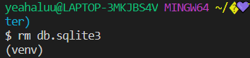
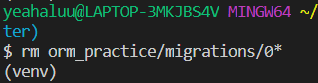
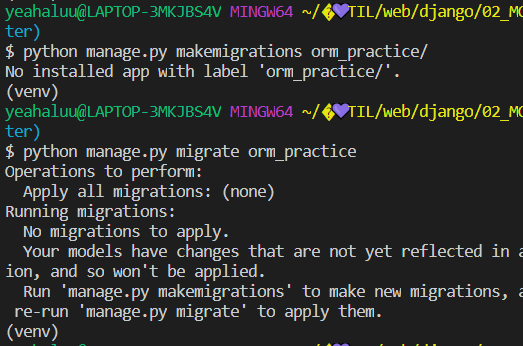
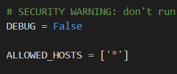
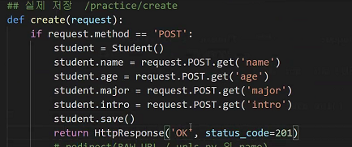
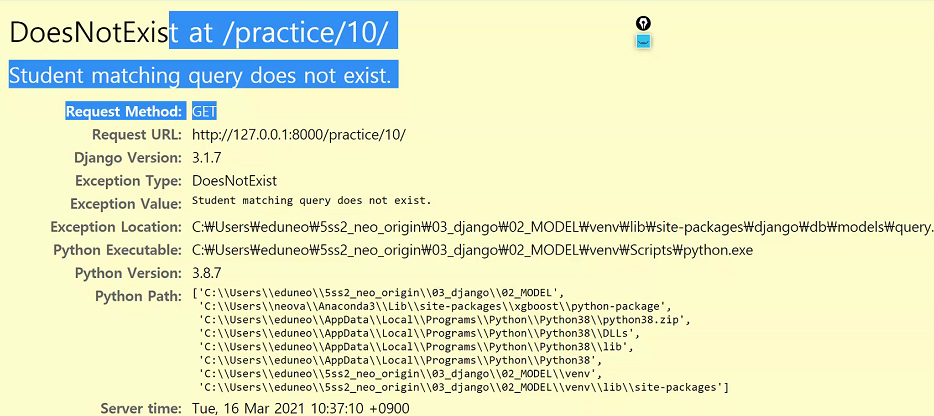
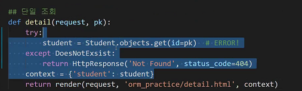
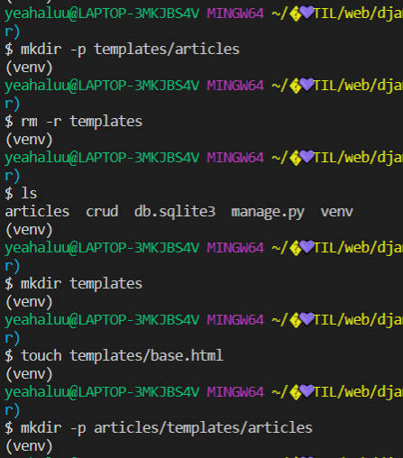
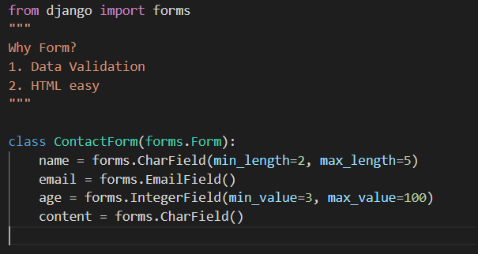
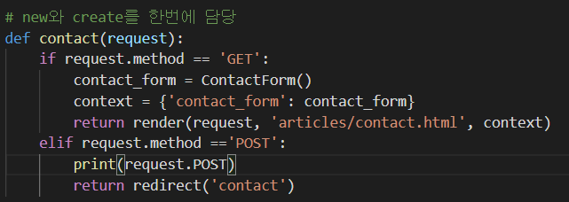

## POST: 꼭 써야돼요?

안 써도 돼요

사용자가 전송할 때, 변화를 줄 때 POST 방식으로 내자

csrf 사이트간 요청 위조

## get 으로 들어가는법

1. 주소창
2. F12 눌러서 POST를 GET으로 바꾼다

## datetime.now() 늦게 들어가는 경우

db와 저장은 ORM으로 연결되어 있다

그런데 버벅거려서 db에서 보낸 시간과 저장소에 저장되는 시간이 3초 차이가 나게 되면?

그래서  db의 시간을 보내야한다.

`created_at = models.DateTimeField(auto_now_add=True, null=True)`

생성 한 값을 비워놓고 싶은데  데이터 베이스는 기본적으로 빈 값을 잘 못본다.

null = True : 이 값에대해 null값을 허용하겠다

1: null=True 안 넣었을 때

2: null=True 넣었을 때

## 추가하다보니 꼬이는거 같다 처음부터 다시 시작하고 싶다

파일을 삭제했다.

0으로 시작하는거 다 지워

지우고 다시 만들엉!

## HTTP 상태코드

setting.py에 이렇게 하면 상태코드만 보여짐

상태코드 종류 보는곳:

https://developer.mozilla.org/ko/docs/Web/HTTP/Status

응답에 status코드를 보낸거(실제 코드 x)

#### 실패

4xx: 책임 소재가 client

5xx: 책임 소재가 server

없는 id를 입력했을 때

여기에 적합한 status_code : 500 (return을 못해서 404가 아니다)

원래는 이게 맞음

이걸 내장함수로 쓰기

500이 아니라 404로 나오는게 맞음! 책임 소재를 분명히!

-> 서버를 더 견고하게 만드는 리팩토링

#### 유효성 검사

서버에서 DB로 data를 보내면서 데이터를 처리하는건 좋지않아

그래서 server에서 데이터 처리하고 심사해서 성공하면 data보내기.

## form

#### post 와 get으로 new, create 같이 구현하기

articles/forms.py

articles/views.py

submit - POST - redirect - GET - contact.html 이렇게가는것

처음에 url로 들어가면 GET 요청으로 들어간 거, 데이터를 넣은 후 submit을 하면 POST 요청